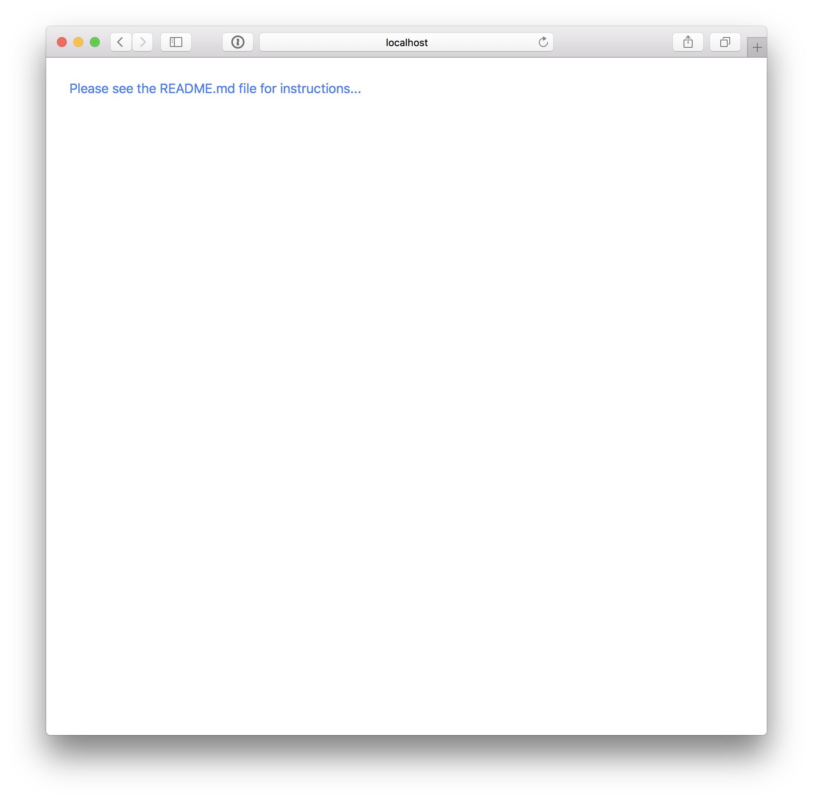

## Instructions

Build a simple front end web app that takes a Github user's username (provided by the user of the application ex. `pdsullivan`). With this username use [Github's api](https://developer.github.com/v3/) to show the users profile data. Also, use the Github api to display a list of the provided user's repositories (just public repos is fine).

The project should not take more than a few hours. It is not a problem if it is taking a long time, just push up the code you have. The purpose of this project is not to complete all of the possible code and design. We really want to just get the code to a point where we can talk through it with you.

Feel free to use any javscript front end framework you wish to use, or feel free to not use a framework at all. 

###### At a minimum, the app should display the following Github user data:
  - Avatar
  - Name
  - Location
  - Public repos

The project is set up to run and compile the javascript with babel, so if you want to write or use any es6 feel free to do so.

#### Submitting the project

When you are done create a new branch named with your name (ex `patrick_sullivan`) and push it up to this remote repository (No need to create a PR or anything).

#### Questions

If you have any questions or if the repo is not working in some way, please send an email to patrick@shipt.com with the issue.

#### Hints

If you like using a linter of some sort this repo is set up with a `.eslintrc` file. Depending on what editor you are using the way you use this will be different. For example in atom you can run `apm install linter-eslint` and the editor should start showing you linter errors and warnings.

If you want to include a css library that is fine but feel free to just write some basic styling on your own.

To change/add styles to the app check in the `./scss` directory and you should be able to add any styles to the `app.scss` file (this gets compiled to the `www/css/app.css` file).

The general structure of the project is mostly under the `www` directory. In ther you will find the `app` directory where the javascript is at (see the `www/app/app.js` file for where to start writing code). The compile commands are set up to run for files under that app directory.

## Running The Project

Make sure you have [Node.js](https://nodejs.org/en/) installed. Also, if you do not have [Bower](https://bower.io/) installed install it after installing node by running `npm install -g bower`.

<!-- Install Ionic (just using that to serve the app into the browser):

```bash
$ npm install -g ionic
``` -->

Then run in the project directory run the following commands to serve the app into the browser:

```bash
$ npm install
$ npm start
```

When you first run the project this is what it should look like in the browser.


"# github-user-search" 
